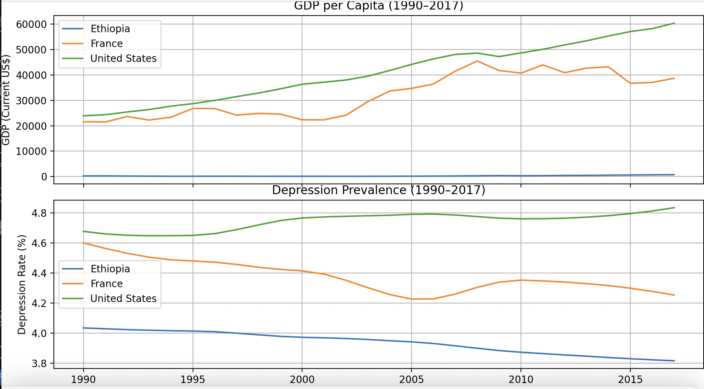

# Project of Data Visualization (COM-480)

| Student's name | SCIPER |
| -------------- | ------ |
| Rania BICHARA| 345616 |
| Hana El Moutaoukil| 340995 |
| Ghalia Bensalem | 330390 |

[Milestone 1](#milestone-1) • [Milestone 2](#milestone-2) • [Milestone 3](#milestone-3)

## Milestone 1

### Dataset

 For our project we chose to work with [the global mental health disorder dataset](https://www.kaggle.com/datasets/thedevastator/global-mental-health-disorders) which is publicly available on Kaggle. This dataset gathers data from 1990 to 2017 on the prevalence of common mental health conditions including schizophrenia, bipolar disorder, eating disorders, anxiety disorders, drug use disorders, depression, and alcohol use disorders from various countries across the globe.

  Moreover, we will also use [the GDP per Capita Dataset](https://data.worldbank.org/indicator/NY.GDP.PCAP.CD?end=2017&start=1990) found on World Bank. This dataset tracks the Gross Domestic Product (GDP) per capita for countries worldwide from 1990 to 2017.

### Problematic

  Does money really buy happiness ? 
  
A timeless question that many psychologists tackled over the years. Obviously, most of us can agree that wealth leads to happiness, as it provides access to better healthcare, education, and overall quality of life. However, some studies suggest that after a certain income level, additional money does not significantly increase happiness. Some rich countries have high rates of depression and anxiety, while some lower-income countries report strong mental well-being. This raises several important questions:
Does economic wealth truly contribute to mental well-being? Can we put a price on happiness ?

The aim of our visualization is to provide an interactive and comprehensive way to understand the impact of money on happiness. Thus, it will provide answers to which are the most and least happy populations ? And, is it related to incomes or not? 

This research challenges the assumption that more money automatically leads to happiness. It provides data-driven insights that can help individuals and communities rethink priorities, focus on well-being beyond financial success, and advocate for mental health awareness in both high- and low-income environments.

It is thus adressed for governments who may study what are the factors that contributes to the well being of its population. Thus either investing more in mental health services, social programs, and work-life balance policies or focusing more on economic expansion. Additionnaly, it can be interesting to curious individuals who want to gather knowledge on this particular topic.

### Exploratory Data Analysis

To begin our analysis, we selected GDP per capita data from the World Bank and depression prevalence data from a global mental health dataset. We filtered the data to focus on three countries: United States, France, and Ethiopia, representing high-, middle-, and low-income economies. We cleaned the GDP data by selecting values from 1990 to 2017, standardizing year formats, and transforming the data so that each country’s GDP could be easily compared across time. 
The U.S. shows a very high and steadily increasing GDP per capita, reaching over $50,000 by 2017. Yet, depression rates remain relatively stable or slightly rising, staying between 4.5% and 6%. This suggests that economic prosperity alone does not prevent mental health issues.

France also demonstrates a high GDP per capita, though slightly lower than the U.S. (around $35,000 to $40,000 in recent years). Interestingly, depression rates are similar to those of the U.S., averaging around 5% to 6%, and show no strong correlation with economic trends. 

In contrast, Ethiopia represents a low-income country, with GDP per capita consistently below $1,000 throughout the studied period. Surprisingly, the reported depression rates are lower than in the U.S. or France, generally between 2.5% and 4%. While this could imply a healthier mental state, it is more likely due to underreporting, limited mental health infrastructure, or cultural stigma that prevents diagnosis and treatment.

Looking at the evolution from 1990 to 2017, we see that while GDP per capita increases significantly in all three countries (at different rates), depression prevalence remains relatively stable or increases slightly. This suggests that economic growth does not necessarily lead to better mental health outcomes.

### Related work

Many have studied this data to showcase the evolution of mental health as well as gdp throughout the years. Also, studies about the relevance of money in the well being is quite large. Our project, differs for what have been done in the way that it actually answers multiple questions on this subject with a series of facts that are explained with multiple plotted graphs. Our work is inspired from Gapminder which is an independent educational non-profit fighting global misconceptions. That through questionnaires and graphs showcases results on different misconceived topics in a playful way. 
## Milestone 2
The milestone 2 is in the ziped document. To lunch the website, click on site.html.
## Milestone 3
open milstone3.zip open site.html on vscode and run the following comand : 
python3 -m http.server 8000
and then open the website locally
